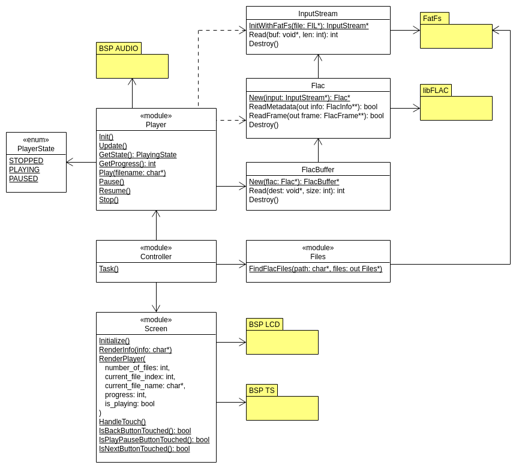
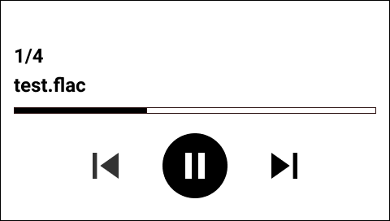
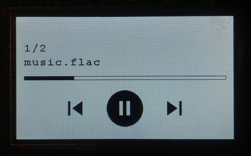

# FLAC player
**Odtwarzacz plików dźwiękowych FLAC**

[](https://www.youtube.com/watch?v=JaSg6u1LkV4)

*(kliknij, aby zobaczyć nagranie)*

---

Projekt realizowany w ramach zajęć z Systemów wbudowanych na AGH

Autorzy: Piotr Janczyk,  Wojciech Musiał

---

Sprzęt:
- [STM32F746G-DISCOVERY](https://www.st.com/en/evaluation-tools/32f746gdiscovery.html)

Oprogramowanie:
- biblioteki ST -- HAL, BSP drivers (audio, LCD, touch screen)
- FreeRTOS
- libFLAC
- FatFs

## Schemat modułów



## Struktura plików źródłowych

```
stm32-flac-player/
├── docs/        ── dokumentacja
├── core/        ── główne moduły projektu
│   ├── include/
│   │   ├── controller.h
│   │   ├── files.h
│   │   ├── flac.h
│   │   ├── flac_buffer.h
│   │   ├── input_stream.h
│   │   ├── log.h
│   │   ├── player.h
│   │   └── screen.h
│   └── src/
│       ├── controller.c
│       ├── files.c
│       ├── flac.c
│       ├── flac_buffer.c
│       ├── input_stream.c
│       ├── log.c
│       ├── player.c
│       └── screen.c
├── libflac/     ── biblioteka libFLAC
├── Drivers/     ┐
├── Middlewares/ ├─ biblioteki ST (HAL, BSP), FreeRTOS
├── Utilities/   ┘
├── Inc/         ┐
├── Src/         ┴─ pliki wygenerowane przez CubeMX
└── Makefile
```

## `Screen` - moduł wyświetlacza i ekranu dotykowego

### Interfejs użytkownika

Projekt:



Realizacja:



### Podwójne buforowanie
Płytka obsługuje sprzętowo dwie warstwy wyświetlacza. W projekcie wykorzystane zostały one do zaimplementowania podwójnego buforowania obrazu.

W danym momencie widoczna jest tylko jedna warstwa. Na drugiej ukrytej warstwie rysowane są elementy UI. Pozakończeniu rysowania warstwy są zamieniane. Podwójne buforowanie pozwala uniknąć migotania ekranu.

```c
// Zmienne globalne
static uint8_t lcd_buffer_0[LCD_X_SIZE * LCD_Y_SIZE * 4] __attribute__((section(".sdram")));
static uint8_t lcd_buffer_1[LCD_X_SIZE * LCD_Y_SIZE * 4] __attribute__((section(".sdram")));

static int visible_layer = 0;
```

```c
// Inicjalizacja warstw
BSP_LCD_Init();
BSP_LCD_LayerDefaultInit(0, lcd_buffer_0);
BSP_LCD_LayerDefaultInit(1, lcd_buffer_1);
```

```c
static void SwapLayers(void) {
    // Poczekaj na VSYNC
    while (!(LTDC->CDSR & LTDC_CDSR_VSYNCS)) {}

    // Przełącz widoczną warstwę
    if (visible_layer == 0) {
        visible_layer = 1;
        BSP_LCD_SetLayerVisible(1, ENABLE);
        BSP_LCD_SetLayerVisible(0, DISABLE);
        BSP_LCD_SelectLayer(0);
    } else {
        visible_layer = 0;
        BSP_LCD_SetLayerVisible(0, ENABLE);
        BSP_LCD_SetLayerVisible(1, DISABLE);
        BSP_LCD_SelectLayer(1);
    }
}
```

### Grafika wektorowa

Do rysowania interfejsu użytkownika wykorzystywane są funkcje z bibloteki BSP, takie jak:
`BSP_LCD_DrawRect`, `BSP_LCD_FillRect` `BSP_LCD_FillPolygon`, `BSP_LCD_FillCircle`, czy `BSP_LCD_DisplayStringAt`.

Ikony przecisków i pasek postępu zdefiniowane są w postaci wektorowej.

Dla przykładu ikona przycisku "wstecz" opisana jest jako:

```c
// Współrzędne lewego-górnego rogu przycisku
static const Point icon_back_position = {98, 172};
// Pierwsza część ikony
static const Point icon_back_points_1[] = {
    {16, 16},
    {20, 16},
    {20, 47},
    {16, 47}
};
// Druga część ikony
static const Point icon_back_points_2[] = {
    {26, 31},
    {47, 16},
    {47, 47},
    {26, 32}
};
```

### Dotyk

Przyciski zdefiniowane są jako prostokątne obszary ekranu dotykowego.

Dla przykładu przycisk "wstecz":

```c
static Button button_back = {
    .position = {98, 172},
    .size = {64, 64},
    .is_touched = false,
    .last_changed_at = 0,
    .was_touched_event = false
};
```

Ze sterownika BSP otrzymujemy informacje o współczędnych miejsca dotyku:

```c
TS_StateTypeDef touch_state;
BSP_TS_GetState(&touch_state);
if (touch_state.touchDetected > 0) {
    // Współrzędne dotyku:
    //   X -- touch_state.touchX[0];
    //   Y -- touch_state.touchY[0];
}
```

Przycisk uznawany jest za naciśnięty, gdy punkt dotyku należy do prostokąta określającego granice przycisku.

### Debouncing

Przycisk uznany zostaje za naciśnięty lub zwolniony jeśli jego stan dotknięcia nie zmienił się przez co najmniej 100 milisekund.

---

Powyższe rozwarzania zrealizowane zostały w ramach modułu `Screen`:

```c
/* core/include/screen.h */

// Zainicjalizuj wyświetlacz i dotyk
void Screen_Initialize(void);

// Wyświetl tekst informacyjny na środku ekranu
void Screen_RenderInfo(const char *info);

// Wyświetl interfejs odtwarzacza
void Screen_RenderPlayer(
    int number_of_files,
    int current_file_index,
    const char *current_file_name,
    int progress,
    bool is_playing
);

// Zaktualizuj stan dotyku
void Screen_HandleTouch(void);

// Odczytaj zdarzenia naciśnięcia przycisków
bool Screen_IsBackButtonTouched(void);
bool Screen_IsPlayPauseButtonTouched(void);
bool Screen_IsNextButtonTouched(void);
```

## `Files` - moduł wyszukiwania plików FLAC

```c
/* core/include/files.h */

typedef struct {
    char files[MAX_FILES_COUNT][MAX_FILE_PATH_LENGTH + 1];
    int count;
} Files;

void FindFlacFiles(const char *path, Files *files);
```

Funkcja `FindFlacFiles` przegląda nośnik pamięci w poszukiwaniu plików z rozszerzeniem ".flac".
Zwraca ciąg ścieżek tych plików.

Do przeglądania katalogów wykorzystywane są funkcje `f_opendir` i `f_readdir` z biblioteki FatFs.


## `InputStream` - moduł strumienia wejściowego z pliku

```c
/* core/include/input_stream.h */

InputStream InputStream_InitWithFile(FIL *file);
int InputStream_Read(InputStream *self, void *buf, int len);
void InputStream_Destroy(InputStream *self);
```

Moduł ten enkapsuluje API FatFs do czytania z plików.
Celem istnienia tego modułu jest separacja miejsc w których odwołujemy się do biblioteki FatFs i biblioteki libFLAC.


## `Flac` - moduł dekodowania plików Flac

### Dekodowanie plików FLAC

#### Inicjalizacja dekodera

Biblioteka libFLAC posiada API oparte o callbacki. Przy inicjalizacji dekodera przekazujemy funkcje, które zostaną wywołane w momencie odczytu lub zapisu danych:

```c
FLAC__StreamDecoder* decoder = FLAC__stream_decoder_new();
FLAC__stream_decoder_init_stream(decoder,
                                 &DecoderReadCallback,
                                 NULL, NULL, NULL, NULL,
                                 &DecoderWriteCallback,
                                 &DecoderMetadataCallback,
                                 &DecoderErrorCallback,
                                 NULL);
```

Plik FLAC rozpoczyna się od _metadanych_, a następnie składa się z ciągu _ramek_. Metadane opisują format dźwięku. Ramki reprezentują fragmenty dźwięku - zawierają próbki dla poszczególnych kanałów. Ramki mogą być zmiennej długości.

Metadane i ramki możemy odczytać przy użyciu poniższych funkcji:

- `FLAC__stream_decoder_process_until_end_of_metadata(decoder)` - odczytuje wszystkie metadane
- `FLAC__stream_decoder_process_single(decoder)` - odczytuje pojedynczą ramkę

Wykonując powyższe funkcje, dekoder wywołuje niektóre z callbacków.

##### DecoderReadCallback

Zadaniem tej funkcji jest odczytywanie danych z pewnego strumienia wejściowego. libFlac pozwala na użycie dowolnego źródła danych.

```c
FLAC__StreamDecoderReadStatus DecoderReadCallback(
   const FLAC__StreamDecoder *decoder,
   FLAC__byte *buffer,
   size_t *bytes,
   void *client_data
) {
   // Wczytaj ‘bytes’ bajtów do bufora ‘buffer’.
   // Zwróć FLAC__STREAM_DECODER_READ_STATUS_CONTINUE, lub
   //       FLAC__STREAM_DECODER_READ_STATUS_END_OF_STREAM, lub
   //       FLAC__STREAM_DECODER_READ_STATUS_ABORT.
}
```

W naszym przypadku odwołujemy się tutaj do biblioteki FatFs i używamy `f_read` do czytania z pliku.


##### DecoderMetadataCallback

Funkcja ta jest wywoływana, gdy dekoder przeczyta fragment metadanych. Otrzymujemy tutaj dostęp do informacji o formacie pliku takich jak:
- ilość próbek
- częstotliwość próbkowania
- liczba kanałów
- liczba bitów na próbkę

```c
void DecoderMetadataCallback(
    const FLAC__StreamDecoder *decoder,
    const FLAC__StreamMetadata *metadata,
    void *client_data
) {
    if (metadata->type == FLAC__METADATA_TYPE_STREAMINFO) {
        // Informacje o formacie audio:
        //   metadata->data.stream_info.total_samples
        //   metadata->data.stream_info.sample_rate
        //   metadata->data.stream_info.channels
        //   metadata->data.stream_info.bits_per_sample
    }
}
```

##### DecoderWriteCallback

Funkcja ta wywoływana jest po przeczytaniu pojedynczej ramki.
Otrzymujemy dostęp do zdekodowanych danych dla poszczególnych kanałów.

```c
FLAC__StreamDecoderWriteStatus DecoderWriteCallback(
    const FLAC__StreamDecoder *decoder,
    const FLAC__Frame *frame,
    const FLAC__int32 *const *buffer,
    void *client_data
) {
    // Zdekodowana ramka:
    //   frame->header.blocksize  - liczba próbek (dla każdego kanału) w tej ramce
    //   buffer[i][j]             - j-ta próbka dla i-tego kanału
}
```

W oparciu o dekoder z biblioteki libFLAC stworzony został moduł `Flac`, który enkapsuluje skomplikowane API oparte o callbacki i udostępnia prostrzy wysokopoziomowy interfejs:

```c
/* core/include/flac.h */

typedef struct Flac Flac;

typedef struct {
    unsigned sample_rate;
    unsigned channels;
    unsigned bits_per_sample;
    uint64_t total_samples;
} FlacInfo;

typedef struct {
    uint8_t *buffer;
    int size;
    int samples;
} FlacFrame;

Flac *Flac_New(InputStream *input);
void Flac_Destroy(Flac *flac);
bool Flac_ReadMetadata(Flac *flac, /*out*/ FlacInfo *info);
bool Flac_ReadFrame(Flac *flac, /*out*/ FlacFrame **frame);
void FlacFrame_Destroy(FlacFrame *frame);
```

## `FlacBuffer` - moduł buforowania zdekodowanych ramek FLAC

```c
/* core/include/flac_buffer.h */

FlacBuffer FlacBuffer_New(Flac* flac);
void FlacBuffer_Destroy(FlacBuffer* self);
int FlacBuffer_Read(FlacBuffer* self, void* dest, int size);
```


## `Player` - moduł odtwarzacza

### Sprzętowe odtwarzanie dźwięku

Sterowniki BSP Audio udostępniają interfejsy do sterowania sprzętowym dekoderem dźwięku i fizycznym wyjściem audio
dostępnym na płytce.

Kolejne próbki dźwięku przesyłane są do sprzętowego dekodera przy użyciu DMA. DMA wczytuje dane z bufora cyklicznego.
DMA wyzwala przerwania przy dojściu do połowy oraz do końca bufora.

BSP Audio udostępnia wysokopoziomowe do sterowania odtwarzania:
```c
BSP_AUDIO_OUT_Play(buffer, size);
BSP_AUDIO_OUT_Pause();
BSP_AUDIO_OUT_Resume();
BSP_AUDIO_OUT_Stop(/*...*/);
```

Sprzętowe odtwarzanie można aktywować w następujący sposób:
```c
uint8_t audio_buffer[AUDIO_OUT_BUFFER_SIZE];

BSP_AUDIO_OUT_Play((void *) audio_buffer, AUDIO_OUT_BUFFER_SIZE);
```

Po włączeniu odtwarzania wywoływane są przerwania
`BSP_AUDIO_OUT_HalfTransfer_CallBack` oraz `BSP_AUDIO_OUT_TransferComplete_CallBack`.

W celu płynnego odtwarzania dźwięku po otrzymaniu przerwania należy
w odpowiednim czasie wypełnić połowę bufora nową porcją danych.


Wypełnianie bufora podczas odtwarzania:
```
1. Rozpoczęcie odtwarzania pliku. Bufer jest pusty

+-------------------------+-------------------------+
|                         |                         |
+-------------------------+-------------------------+

2. Zdekodowanie metadanych

3. Wypełnienie pierwszej połowy bufora

+-------------------------+-------------------------+
| 11111111111111111111111 |                         |
+-------------------------+-------------------------+

4. Rozpoczęcie odtwarzania

+-------------------------+-------------------------+
| 11111111111111111111111 |                         |
+-------------------------+-------------------------+
^
odtwarzany fragment

5. Wypełnianie drugiej połowy bufora (zanim skończone zostanie odtwarzanie pierwszej połowy)

+-------------------------+-------------------------+
|             11111111111 | 22222222222222222222222 |
+-------------------------+-------------------------+
              ^
              odtwarzany fragment

6. Występuje przerwanie informujące o dojściu do połowy (BSP_AUDIO_OUT_HalfTransfer_CallBack)

+-------------------------+-------------------------+
|                         | 22222222222222222222222 |
+-------------------------+-------------------------+
                          ^
                          odtwarzany fragment

7. Wypełnianie pierwszej połowy bufora (zanim skończone zostanie odtwarzanie drugiej połowy)

+-------------------------+-------------------------+
| 33333333333333333333333 |              2222222222 |
+-------------------------+-------------------------+
                                         ^
                       odtwarzany fragment

8. Występuje przerwanie informujące o dojściu do końca (BSP_AUDIO_OUT_TransferComplete_CallBack)

+-------------------------+-------------------------+
| 33333333333333333333333 |                         |
+-------------------------+-------------------------+
                                                    ^
                                  odtwarzany fragment


9. Wypełnianie drugiej połowy bufora (zanim skończone zostanie odtwarzanie pierwszej połowy)

+-------------------------+-------------------------+
|             33333333333 | 44444444444444444444444 |
+-------------------------+-------------------------+
              ^
              odtwarzany fragment

10. Przejdź do punktu 6.
```

Moduł `Player` zapewnia wysokopoziomowe API do sterowania odtwarzania plików:

```c
/* core/include/player.h */

typedef enum {
    PlayerState_Stopped,
    PlayerState_Playing,
    PlayerState_Paused
} PlayerState;

void Player_Init(void);
void Player_Update(void);

PlayerState Player_GetState(void);

// Podstęp odtwarzania w skali 0-1000
int Player_GetProgress(void);

void Player_Play(const char *filename);
void Player_Pause(void);
void Player_Resume(void);
void Player_Stop(void);
```


## `Controller` - główny moduł sterujący

Zadaniem kontrolera jest koordynacja ekranu (`Screen`) i odtwarzacza (`Player`).

Kontroler inicjalizuje wszystkie moduły:

```c
// Zainicjalizuj wyświetlacz
Screen_Initialize();

// Odczekaj na pamięć masową
Screen_RenderInfo("Waiting for USB drive...");
WaitForUsbStorage();

// Wyszukaj plików FLAC w pamięci masowej
Screen_RenderInfo("Searching FLAC files...");
FindFlacFiles("1:", &files);

// Zainicjalizuj odtwarzacz
Screen_RenderInfo("Initializing player...");
Player_Init();
```

Następnie wykonywana jest główna nieskończona pętla aplikacji:

```c
for (;;) {
    Screen_HandleTouch();
    Screen_RenderPlayer(
        /*number_of_files*/ files.count,
        /*current_file_index*/ current_file_index,
        /*current_file_name*/ files.files[current_file_index],
        /*progress*/ Player_GetProgress(),
        /*is_playing*/ Player_GetState() == PlayerState_Playing
    );

    if (Screen_IsPlayPauseButtonTouched()) {
        PlayOrPause();
    } else if (Screen_IsBackButtonTouched()) {
        SkipPrevious();
    } else if (Screen_IsNextButtonTouched()) {
        SkipNext();
    }

    Player_Update();
}
```

Moduł kontrolera posiada tylko jedną publiczną funkcją - po jej wywołaniu kontroler przejmuję kontrolę na wykonaniem programu:

```c
/* core/include/controller.h */

void Controller_Task(void);
```
